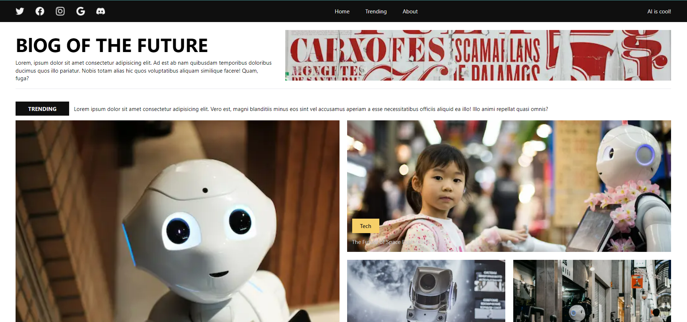
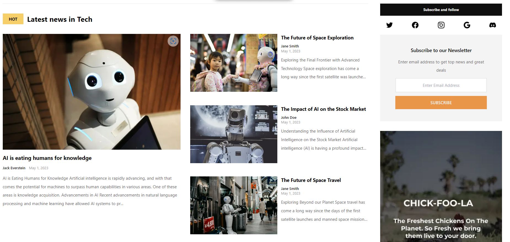

# Next.js 13.3 App with Auto ChatGPT Content

_There is an error message that says that the current Prisma configuration is not compatible with the deployment on Windows, and as a result, deployment cannot be completed. To resolve this issue, the Prisma configuration needs to be updated to a version that is compatible with the deployment environment._

This is a simple application built with Next.js 13.3, Prisma, TipTap, Typescript, and deployed on Vercel. The app allows users to edits posts, also features an auto chatbot powered by OpenAI's GPT language model.

## Tech Stack

### Next.js 13.3:

A React framework that makes it easy to build server-side rendered applications.

### Prisma:

A database ORM that simplifies database management and integration.

### TipTap:

A WYSIWYG ("What you see is what you get") editor for Vue.js and React that allows for easy formatting of text and HTML content.

### Typescript:

A superset of Javascript that adds static typing and improves code maintainability.

### OpenAI's GPT:

A language model that can generate natural language text.

